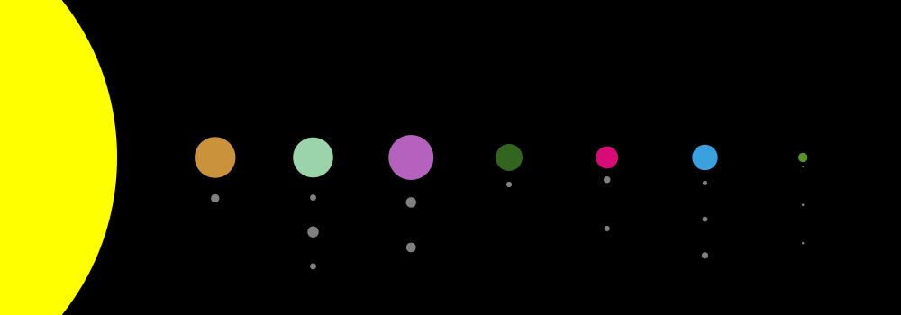

Space Art!
==========

This repository holds a collection of scripts which are able to create
generative art (art generated by an autonomous system) focused on space and
astronomy.

#### Solar System: might this one exist within The Universe?

#### Background Stars: a minimalist night sky

